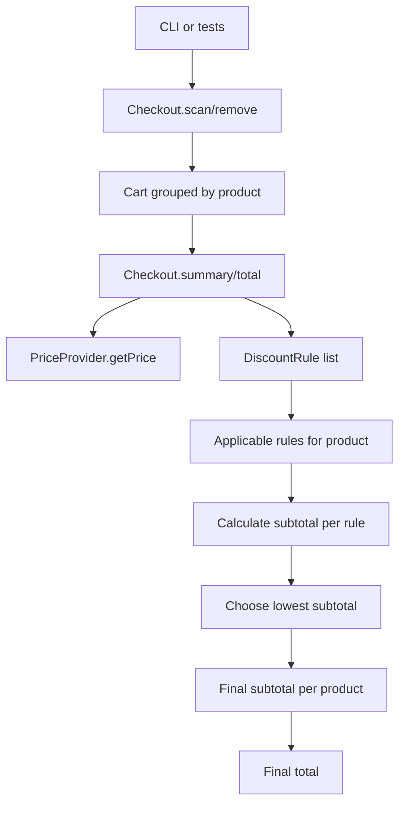

# Fuul Backend Challenge

Checkout system for an NFT marketplace. The application calculates cart totals, applies product discounts, mocks an external price source, and includes an interactive CLI simulator.

## Approach

The solution uses a lightweight Clean Architecture approach. The project keeps business rules separate from infrastructure and CLI concerns, but avoids creating layers that are not needed for the size of the challenge.

- `src/domain/`: product codes, discount rules, subtotal calculation, and contracts.
- `src/application/`: `Checkout`, the main use case used by tests and the CLI.
- `src/infrastructure/`: `MockPriceProvider`, which represents the external price source.
- `src/cli.ts`: interactive simulator.
- `src/cli-renderer.ts`: terminal rendering helpers for tables and colors.

SOLID is applied pragmatically: discount rules are open for extension, price lookup is injected through a contract, and the CLI delegates all pricing behavior to `Checkout`.

## Discount Decisions

The challenge leaves `AZUKI` ambiguous because it qualifies for both promotions. This implementation does not stack discounts. Instead, each applicable rule is evaluated independently and the best subtotal is selected.

For three equal products:

- `APE x3`: `buy-2-get-1-free`, total `150 ETH`.
- `PUNK x3`: bulk discount, total `144 ETH`.
- `AZUKI x3`: best discount wins, total `60 ETH`.
- `MEEBIT x3`: no discount, total `12 ETH`.

Unknown product codes throw an error. Removing a valid product that is not in the cart is treated as a no-op.

## Public API

```typescript
import { createDefaultCheckout } from './src/index.js';

const checkout = createDefaultCheckout();

checkout.scan('APE');
checkout.scan('APE');
checkout.scan('PUNK');
checkout.remove('APE');

console.log(checkout.total());
console.log(checkout.summary());
```

`summary()` returns regular totals, applied discounts, final totals, and per-product lines. The CLI uses this method to display discount details without duplicating pricing logic.

## Total Calculation Flow



## Adding a New Discount

New discounts are added by implementing the `DiscountRule` contract and registering the rule in `defaultDiscountRules`. `Checkout` does not need to change because it only receives a list of rules and chooses the best subtotal.

```typescript
export class MeebitVolumeDiscountRule implements DiscountRule {
  readonly name = 'meebit-volume-10-percent-off';

  appliesTo(productCode: ProductCode): boolean {
    return productCode === 'MEEBIT';
  }

  calculateSubtotal({ quantity, unitPrice }: DiscountContext): number {
    return quantity >= 5 ? quantity * unitPrice * 0.9 : quantity * unitPrice;
  }
}
```

## Current Limitations

Discounts are evaluated per product group, not across the full cart. A rule can apply to multiple product codes, but it still receives one product at a time.

For example, the current design supports `APE x3` or `AZUKI x3` as separate buy-2-get-1-free cases. It does not support a mixed promotion such as `APE x2 + AZUKI x1`, where the customer pays for the two `APE` items and gets the cheaper `AZUKI` discounted.

Supporting cross-product promotions would require cart-level discount rules that receive the full cart and price map before calculating the discount.

## Setup

Use Node `24` as specified in `.nvmrc`.

```bash
nvm use
pnpm install
```

## Commands

```bash
pnpm start
```

Runs the interactive checkout simulator. It lets you scan items, remove items, view the cart, and view a total breakdown with regular price, applied discounts, and final total.

```bash
pnpm test
pnpm test:coverage
pnpm lint
pnpm typecheck
pnpm format:check
```

Runs tests, coverage validation, ESLint, TypeScript checks, and Prettier validation.

## CI Pipeline

GitHub Actions runs a single `CI` workflow on `push` to `main` and on pull requests.

The workflow installs dependencies, checks formatting, runs ESLint, runs TypeScript checks, runs tests with coverage, and uploads the `coverage/` report as an artifact.

Coverage is configured in `vitest.config.ts` with an 80% global threshold for statements, branches, functions, and lines.

## Simulator

Start the simulator with:

```bash
pnpm start
```

Available actions:

- `Scan item`: add one product to the cart.
- `Remove item`: remove one product from the cart.
- `View cart`: show current quantities.
- `View total breakdown`: show regular totals, discounts applied, and final total.
- `Exit`: close the simulator.

The simulator is only an input/output adapter. It does not calculate prices or discounts directly.
